# 🏠우리집SNS

> Share Emotion - 감정을 공유해요🥰.
>
> Network Family - 가족과 함께👪.
>
> Save Memory - 그리고, 저장하세요💾.

- 디지털 시대에 맞는 가족간의 소통창구
- 가족간의 새로운 추억공간 제공
- 소통하기 점점 힘들어지는 자녀들과의 소통채널
- 장거리에 있는 가족과의 심리적 거리 좁히기

 

### 주요기능🎈

- 가족들만의 private한 공간에서 피드(사진, 영상 등) 공유
- 가족들의 지난 역사와 행적을 돌아볼수있는 추억여행기능
- 원활한 가족일정 계획을 위한 가족 개개인의 일정공유기능
- 가족간의 즐거운 소통을 위한 투표와 미니게임 기능

 

### 주요기술🛠

- Google Map API를 활용한 지도서비스
- WebSocket을 이용한 실시간 알림
- JWT를 사용한 유저인증
- PWA를 이용한 웹앱

 

## Team - 우家우가팀🎀

> **우**리**집**, **우**리**가**족

 

### Notion📚

https://www.notion.so/2-1-SNS-40da49792c554a05bc2bd92403d28512

 

### R&R💻

| 강동옥             | 김태현   | 박상준   | 임창현  | 최이삭  |
| ------------------ | -------- | -------- | ------- | ------- |
| Frontend & Backend | Frontend | Frontend | Backend | Backend |
| 서기               | 서기     | UCC제작  | 부팀장  | 팀장    |

 

### Wireframe

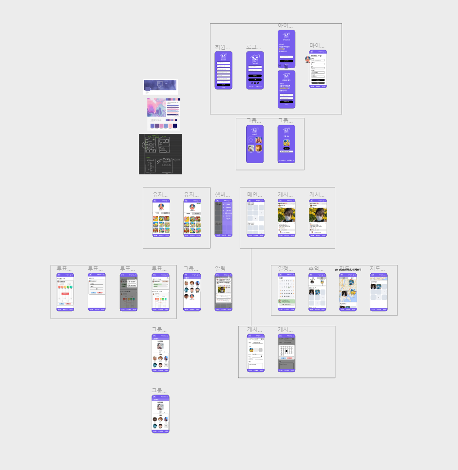

 

### ERD

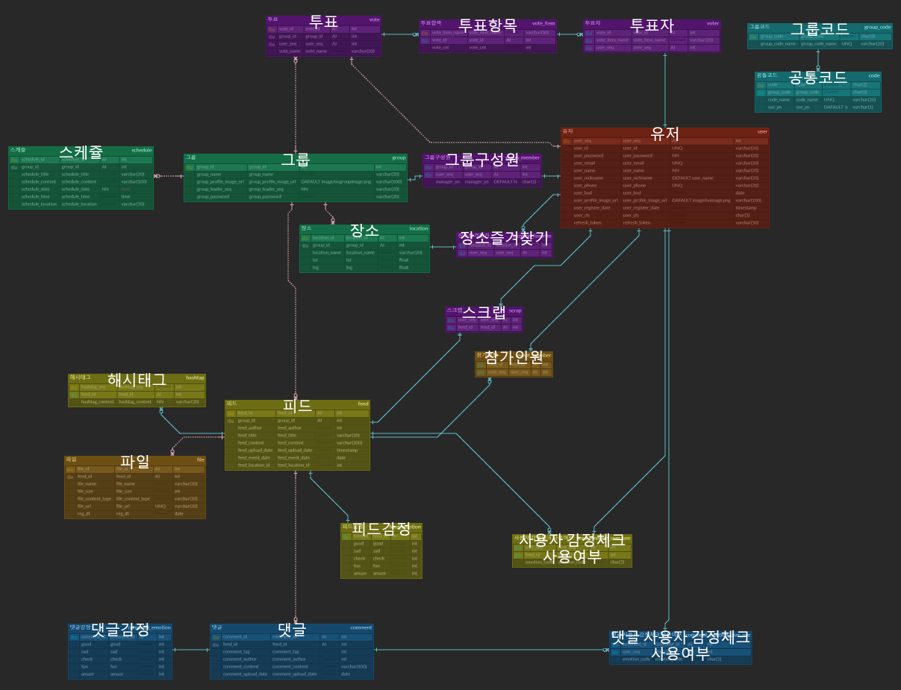

 

## 개발환경

- Vue.js 2
- VueCLI → 4.5.15
- Vuetify
- VsCode(IDE) → 1.58.1
- NodeJs  → 14.16.0
- JAVA
  - openjdk version "1.8.0_292"
  - OpenJDK Runtime Environment (Zulu 8.54.0.21-CA-win64) (build 1.8.0_292-b10)
  - OpenJDK 64-Bit Server VM (Zulu 8.54.0.21-CA-win64) (build 25.292-b10, mixed mode)
- Spring Boot
  - 'org.springframework.boot' version '2.6.2'
  - io.spring.dependency-management' version '1.0.11.RELEASE'
- STS (IDE)
  - sts-3.9.14.RELEASE 버전
- Server
  - Computer : AWS EC2 → Ubuntu 20.04 LTS
  - DB : MySQL  → 8.0.28
  - WAS : Nginx → 1.18.0

- Gitlab
- Jira
- Discord

 

## 총평

- 강동옥
  - 프로젝트 초반에는 기존에 사용했던 Django와 spring-boot가 너무 다르고 spring-boot에 대해 아는 것이 별로 없어서 백엔드 팀원들과 소통하는 부분에 다소 어려움이 있었다.
  - 프로젝트 중에 실시간 알림기능을 백엔드 부분까지 구현해보면서 spring-boot에 대한 공부가 많이 되어서 이후로는 좀 더 원활한 소통을 할 수 있었다.
  - 지난프로젝트때 실시간으로 구현하지 못해서 아쉬웠던 알림기능을 WebSocket과 STOMP를 이용해 구현해볼 수 있어서 좋았다.
  - 사다리타기를 구현할 때 인터넷에 올라와있는 소스를 가져오기만 하면 사용할 수 있을줄 알았는데, 찾을 수가 없어서 React로 구현되어있는 코드와 JS로 구현된 코드를 보면서 Vue.js에 맞도록 직접 구현하는 경험을 할 수 있었다. ⇒ React에 대해서 추가로 공부해보고 싶다.
  - Vuetify라이브러리를 사용하면서 편리한점이 매우 많았지만 커스텀하지 못하는 부분들이 있어서 아쉬웠다.
  - 로컬에서 테스트하면서 보는 페이지와 서버에 배포된 페이지에서 서로 상이한 부분(하단 네비바 크기 관련)이 있어서 따로 처리를 해줬는데 이부분이 정확이 어떤원리로 그렇게 되는지 좀 더 공부해봐야겠다.
  - 코드 가독성 향상을 위해 컴포넌트를 사용하는 경우나 데이터 사용을 편리하게 하기 위해 vuex를 사용했는데, 이것이 오히려 역효과가 나서 코드가 더 복잡해지는 경우가 있었다. 오버엔지니어링을 지양해야겠다.
  - Vue의 router기능을 잘 활용하지 못했었는데, 화면전환시에도 background가 유지될 수 있도록 하기 위해 공부하면서 nested routing을 배울 수 있었다.
  - 또한, 로그인 등 인증되지 않은 상태에서 특정 페이지에 접근하는 것을 막기 위해 router guard를 사용해보면서 router에 대한 이해도를 올릴 수 있었다.
- 김태현
  - 로컬에서 테스트시 이미지 업로드에 문제가 있어 작은 수정사항에도 배포까지 해서 테스트 해야해서 불편했다.😭
  - Google Map API 중 현재 위치의 주소를 가지고 오기위해 공부를해서 사용하려는데 유료하는 소식을 들어서 당황을 했다.🙄 그래서 네이버 map api를 사용하여 현재위치를 가지고 왔다. 하지만.. 네이버에서 서버쪽에서 요청을 막았다고 한다..(😱)그래서 로컬에서 돌렸을 때는 되었지만 서버에서 사용하기 위해서는 백쪽에서 요청이 불가피했다. 시간이 없어서 구현을 못한게 조금 아쉬웠다.
  - 피드 작성하는 페이지에서 생각보다 받아야하는 데이터가 다양하고 , vuetify 라이브러리에서 제공하는 것들을 따로 커스텀해야해서 힘들었지만, 힘든만큼 많이 배울 수 있어서 좋았다. (vuetify의 꽃🌺은 v-row 와 v-col..)
  - 구글맵 마커를 커스텀해야했는데, 수많은 html 영어 코드 속 ‘부엉부엉시부엉’ id가 눈에 잘 띄어서 동옥공주와 인고의 시간끝에 커스텀 완료!😆
  - 스프링 맛보기로 흐름만 배웠는데 자바언어 공부하는 겸 스프링도 같이 공부해보고 싶다는 생각이 들었다.
  - 코드짜는 것 이외에 알아야하는 것들이 꽤 많았다..! 동료들은 잘 아는데 나는 잘 몰라서 조금 힘들었는데 특화전에 기본 개념을 다져야겠다.
  - 프론트 역할은 처음이었는데, 팀원들한테 배운게 많았다! 그리고 오래 앉아있다고 능률이 오르는 건 아니지만 오래 안 앉아있으면 안 될 것 같아요..
  - 결론 : 잘 작동되지 않을 땐 머릿속으로 결론을 내린 후 코드를 수정할 것이 아니라, 원인분석을 하면서 수정을 해야 능률이 오른다는 것을 깨달았다.
- 박상준
  - 스케줄러를 구현하는데있어 JavaScript 숙련도 문제에 고민하게 되었다. 프론트 개발의 기초가 된다고 생각하는 부분인데 많은 보완이 필요할듯하다
  - PWA를 적용해보면서 많은 시행 착오가 있었다. (SSL 적용을해야 PWA 작동이 되는데 설정이 잘 못된줄 알고 많은 시간을 허비) 또 웹앱의 편리함을 느끼는 계기가 되었다.
  - Vuetify를 가지고 UI 구성을 위해 Vue.js 2를 사용하였는데 다음 프로젝트는 Vue.js 3를 사용해보고싶다.
  - 아직까지 서버와 데이터 연동할때 미숙한 점이 많았다. 자바스크립트 공부하면서 비동기에 관해 다시 한번 살펴보자.
  - 관련하여 백엔드 부분은 몰라도 너무 모른다 장고만 써보고 아직 자바와 스프링부트를 공부해본적 없는 것도 일부분이였고, 개념 자체의 부족함을 많이 느꼈다.
  - 프론트에서 가장 수요가 많은 리액트 공부도 해봐야한다 가장 많이 쓰는 만큼 커뮤니티 활성화가 매력적이였다.
  - 외에도 이번에 공부해보면서 플러터나 스벨트의 정보도 알게되었다. 기회가 난다면 순차적으로 공부 해보고싶다.
  - 많이 부족하다 더 정진하자
- 임창현
  - spring-boot를 담당하면서, REST ful API 설계에 대해서 여러 고민을 해볼 수 있는 시간이 되었다. SWAGGER UI를 사용해서 URI관리를 해보고 싶다.
  - 인증을 위한 수단으로 JWT를 사용했는데, 계정의 권한을 나눠서 부여하는 방식을 사용해보지 못했고소셜 로그인 기능을 합쳐서 OAuth2.0 + JWT 기능을 구현해보지 못해서 아쉬웠다.
  - 다음 프로젝트는 spring-data-jpa 를 사용하여 DB에 접근하는 방식을 배워보고싶다.
- 최이삭
  - Spring Boot 와 MVC 패턴을 한번 더 숙지 하고 익숙해질 수 있었던 좋은 프로젝트 였다.
  - Git과 JIRA와 조금은 친해졌달까…
  - 이전에 사용하던 Apache대신 Nginx WAS를 사용해 보았는데 설정파일을 셋업하는데 애를 많이 먹었다. 생각보다 시간이 많이 딜레이 되어서 학습하려던 Jenkins와 Docker를 활용해 보지 못하였는데 다음 프로젝트때는 학습해서 사용해봐야겠다.
  - 배포할때 Vue파일을 Spring안에 빌드하고 한번에 jar파일로 만들어 배포 하였는데 이미지 접근 경로와 SPA방식의 웹의 문제인 새로고침할때의 이슈를 해결하는데 힘듦이 있었다. 새로고침시 index.html로 보내줘야 하는데 jar파일 안에 index.html이 같이 들어있어 발생한 이슈였다. vue와 spring을 각각 따로 빌드하여 배포함으로 이를 해결 할 수 있었다.
  - 마지막 한주는 인간 jenkins가 되어서 서버에서 테스트 해야 하는 것들을 위해 무한 [깃풀 - 빌드 - 배포]를 하였다. 다음에는 꼭 jenkins를 학습하자!
  - 만약 다시 만든다면 적용해 보고 싶은것 Swagger , JPA , Jenkins, Docker

 

## 시연

### 1. 회원가입 및 로그인

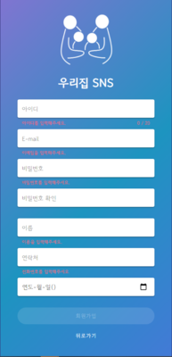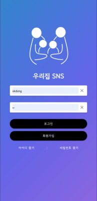

- 회원가입 및 로그인 기능

 

### 2. 아이디 및 비밀번호 찾기

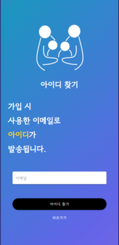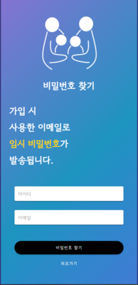

- 가입시 사용한 이메일 주소를 이용해 아이디와 비밀번호를 찾을 수 있다.

 

### 3. 그룹 추가 및 선택

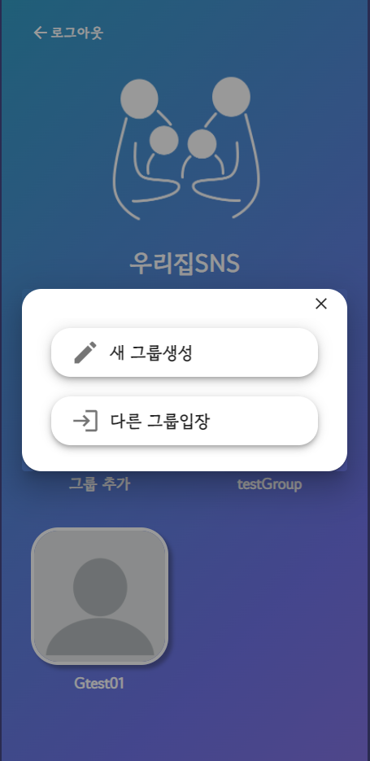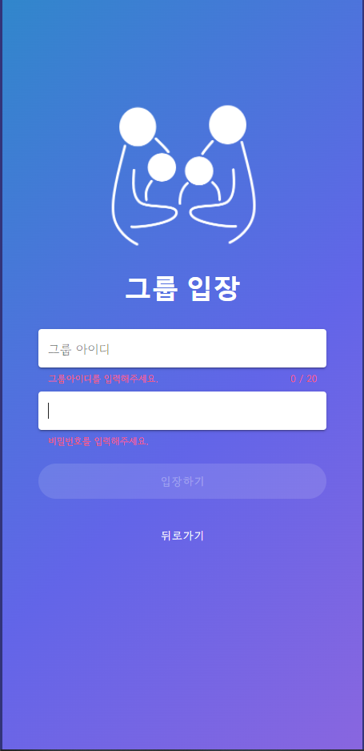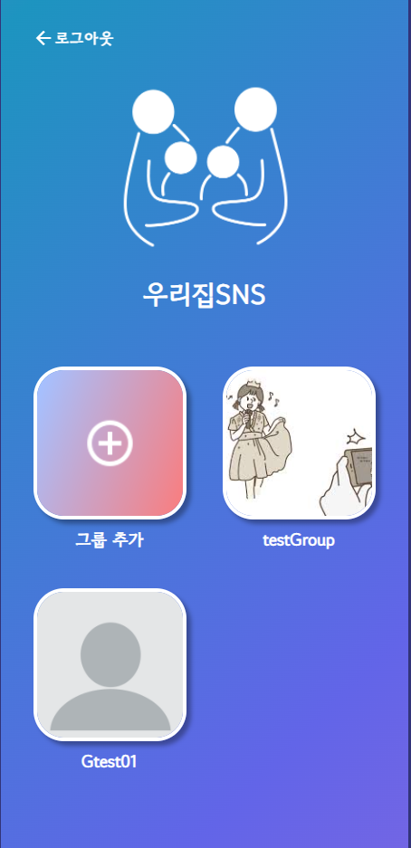

- 새로운 그룹을 생성하거나 기존에 속해있지 않았던 다른 그룹에 입장할 수 있다.
  - 다른그룹의 그룹아이디와 그룹비밀번호를 이용해 입장할 수 있다.
- 새로 생성하거나 입장한 그룹은 그룹목록에 표시되며, 그룹을 선택해 해당 그룹으로 입장할 수 있다.

 

### 4. 게시물 - 시간여행 - 추억여행 - 일정표

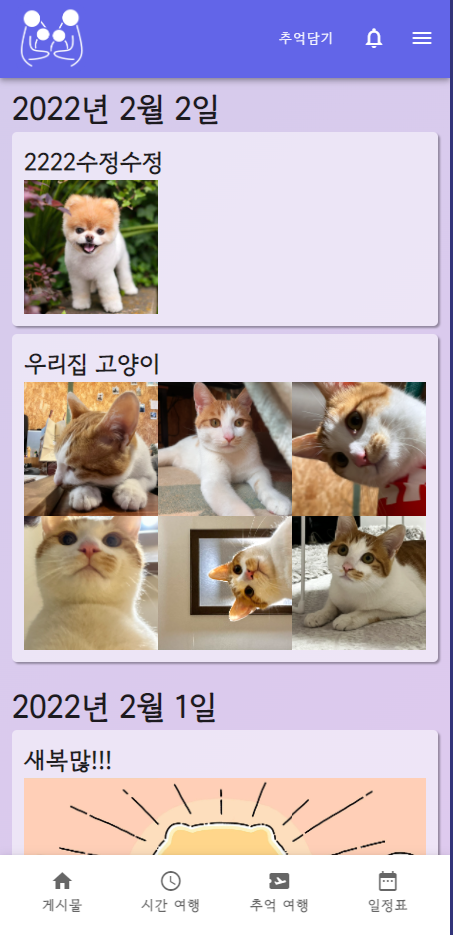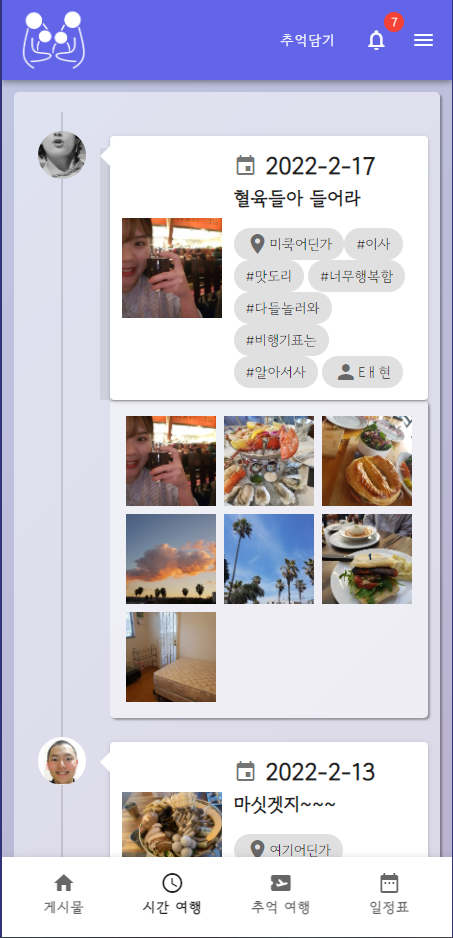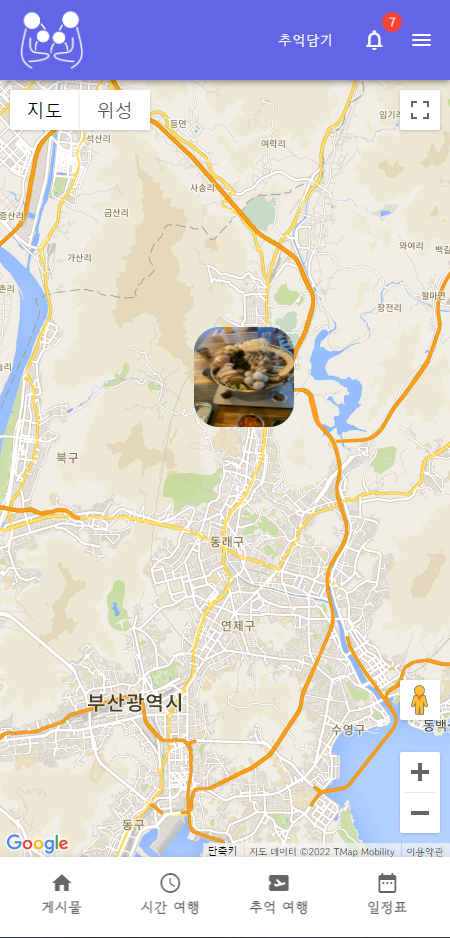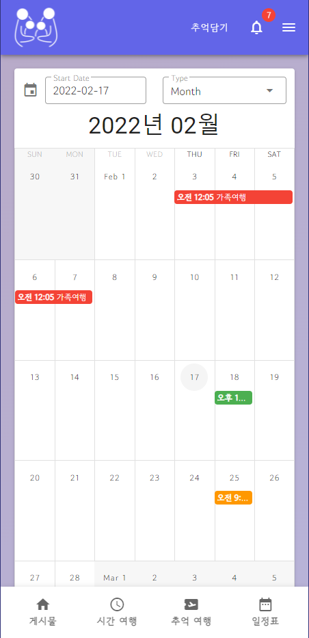

- 게시물 
  - 가족그룹에 게시된 모든 피드를 조회할 수 있는 페이지
- 시간여행 
  - 피드 중에서 중요한 행사로 등록된 피드를 시간순으로 조회할 수 있는 페이지
- 추억여행
  - 가족그룹에 게시된 피드를 지역별로 조회할 수 있는 페이지
- 일정표 
  - 가족행사 등을 등록해 가족간의 일정을 공유할 수 있는 페이지

 

### 5. 게시물 작성

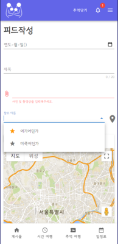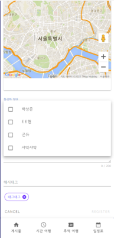

- 추억담기 버튼을 통해 새로운 게시물을 추가할 수 있다.
- 지도를 통해 장소를 등록할 수 있으며, 과거에 사용했던 장소와 즐겨찾기로 등록해둔 장소를 사용할 수도 있다.
- 그룹원을 추가하거나 해시태그를 추가할 수도 있다.

 

### 6. 게시물 상세

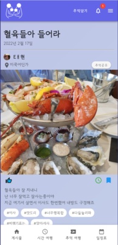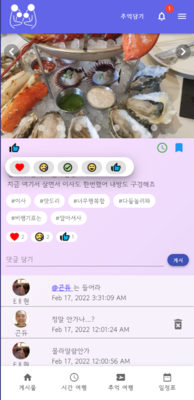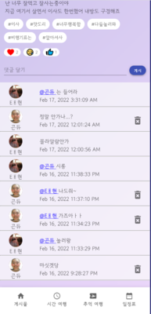

- 게시물의 상세내용을 조회할 수 있으며, 해당 게시물에 작성된 댓글을 조회할 수 있다.
- 게시물 사진 아래 좌측 좋아요 버튼을 누르면 5가지 감정표현중에 하나를 선택할 수 있다.
- 게시물 사진 아래 우측 버튼들을 통해 그룹원과 공유되는 시간여행에 추가하거나 개인적으로 스크랩할 수도 있다.
- 새로운 댓글 작성이 가능하며 @문자를 입력하여 다른 그룹원을 태그할 수 있다.

 

### 7. 실시간 알림기능

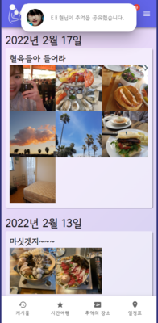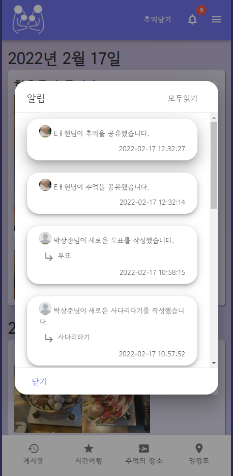

- 같은 가족그룹 내 다른사람이 아래와 같은 행동을 했을 때 해당하는 대상에게 실시간으로 알림이 전송된다.
  - 피드작성
  - 댓글작성
  - 댓글에 태그
  - 미니게임(사다리타기/투표) 작성
  - 추억공유
- 알림창에서 알림을 눌러 해당 게시물로 이동할 수 있다.

 

### 8. 미니게임(사다리타기 & 투표)

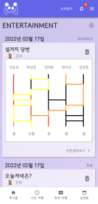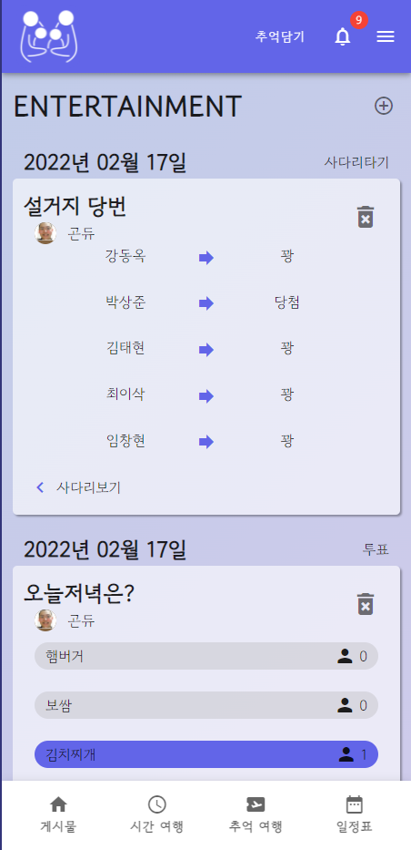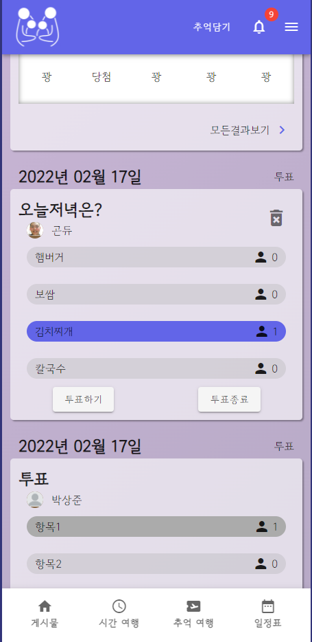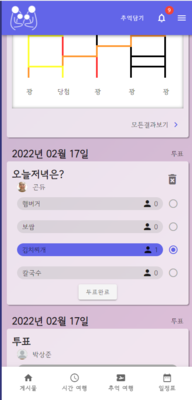

- 가족간의 오락거리로 사용할 수 있는 사다리타기와 투표기능이다.
- 우측상단의 +버튼으로 새로운 사다리타기 투표기능을 추가할 수 있다.

 

### 9. 그룹프로필

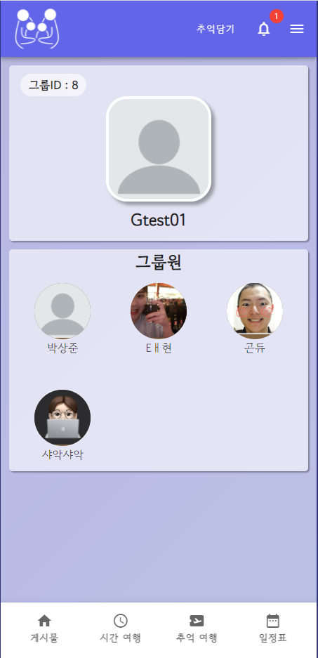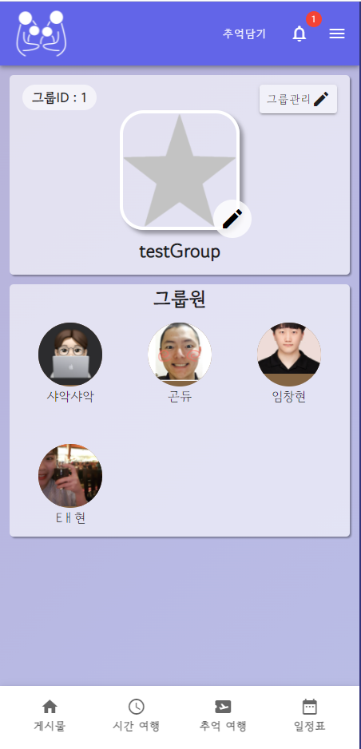

- 그룹 프로필 페이지에서 그룹ID와 그룹원들을 조회할 수 있다.
  - 권한이 있는 사용자에게만 그룹정보를 수정할 수 있는 그룹관리 버튼이 출력된다.
- 그룹관리 페이지에서는 그룹프로필 사진과 이름을 수정할 수 있다
  - 그룹원에게 매니저권한을 부여할 수 있으며 그룹원을 추방할 수도 있다.

 

### 10. 개인프로필

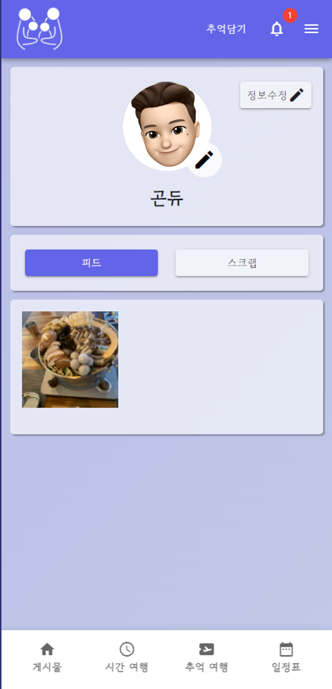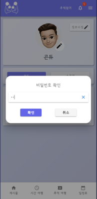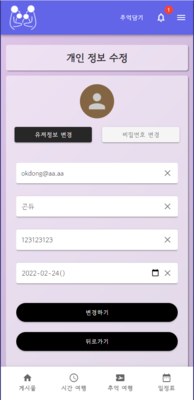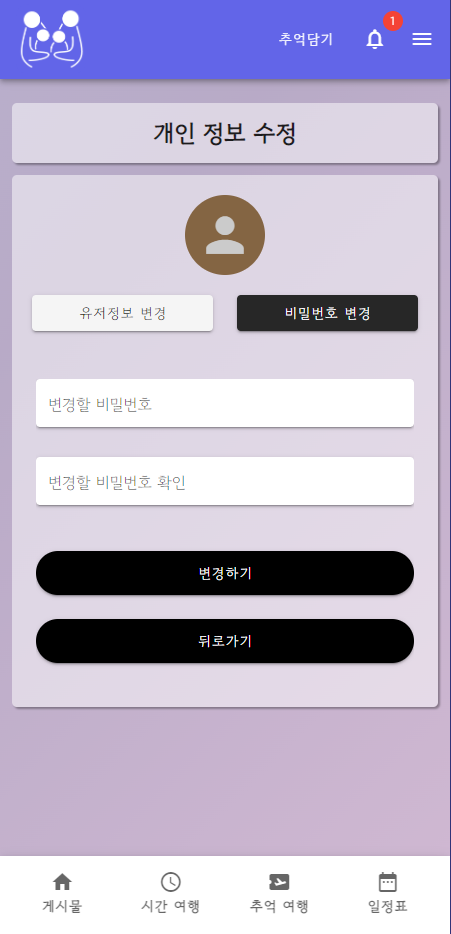

- 개인 프로필 페이지에서 해당유저가 작성한 게시물과 스크랩한 게시물을 조회할 수 있다.
  - 본인의 프로필 페이지일 경우 프로필 사진을 수정할 수 있고 정보수정 버튼이 출력된다.
  - 비밀번호를 입력해 본인인증을 한 경우에만 개인정보 수정 페이지로 이동할 수 있다.
- 개인정보 수정 페이지에서 유저의 정보나 비밀번호를 변경할 수 있다.
- URL을 통해 개인정보수정페이지로 비정상적인 접근을 할 경우 그룹선택페이지로 강제이동된다.

 

## 추가로 구현해보고 싶은 것들

- 가족그룹만을 위한 미션기능

  - 특정포즈로 사진찍기
  - 과거사진 찾아서 올리기
  - 가족 100문 100답
  - 등등

- 미션성공시 미션성공 뱃지 등을 부여해서 유저프로필이나 그룹프로필에서 조회할수 있도록 하는기능

- 위 미션과 관련해서 다른 가족들과 익명으로 경쟁할 수 있는 시스템

  
